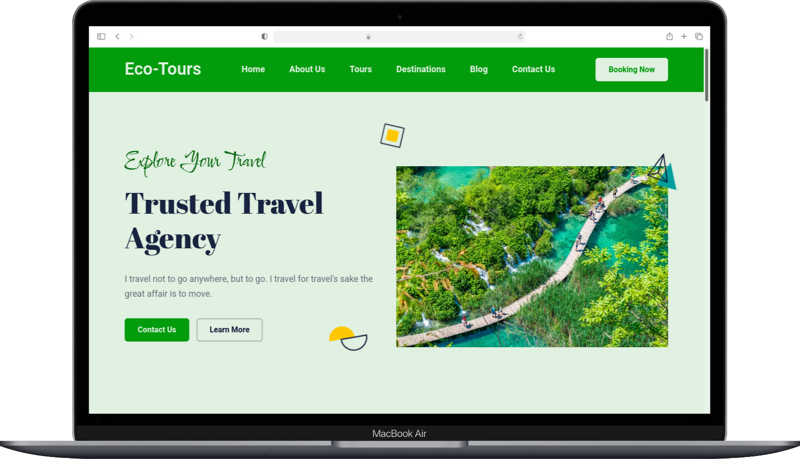
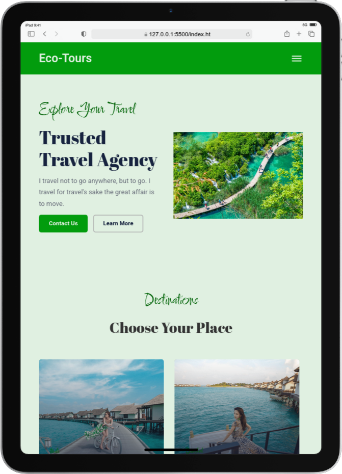

  
  <h2 align="center">Eco-Tour Travel Website</h2>

Eco-Tour is fully responsive travel website,  Responsive for all devices, built using HTML, CSS, and JavaScript.

<a href="https://techbydami.github.io/Travels_and_Tours_Website/"><strong>➥ Live Demo of Project</strong></a>

 

### Eco-Tour Homepage Demo Screenshots

### License

This project is **free to use** and does not contains any license.

&copy; 2022 codewithsadee

---

<h3 align="left">Connect with me:</h3>

